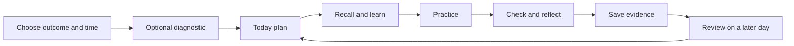

# UX and UI specification

## Experience principles

The learner should know what they will accomplish, how much effort remains, and how to check the result. Use plain language for nontechnical paths and reveal technical detail when the task requires it. Prefer one clear next action over a large catalogue or open-ended chatbot.

Visual direction: calm, practical, optimistic. Warm off-white canvas, dark ink text, restrained indigo action color and green success accents. Avoid neon AI imagery and gamification that pressures users to rush.

## Information architecture

Primary navigation: **Today · Paths · Portfolio · Progress**. Settings includes learning preferences, accessibility, timezone, notification consent, data export and deletion. On mobile use four bottom navigation items; on desktop use a left navigation rail. A lesson opens a focused workspace with a visible exit and save state.

Routes: `/start`, `/today`, `/paths`, `/paths/:slug`, `/learn/:lessonId`, `/review`, `/portfolio`, `/portfolio/:artifactId`, `/progress`, `/settings`. Content editors use Git in MVP; no hidden admin interface is implied.



## Key screens

| Screen | Essential content | Primary action | Important state |
|---|---|---|---|
| Welcome | Reassure search-only beginners; compare Google Search and ChatGPT in plain language; show the 15-minute outcome | Start my first AI lesson | No account or technical vocabulary required |
| Onboarding | Role, goal, time, optional baseline | Build my plan | Skip diagnostic without penalty |
| Today | Next outcome, units, due review, progress | Start / Resume | Completed day suggests optional next unit |
| Path detail | Skills, prerequisites, lesson sequence, access requirements | Start next lesson | Planned paths clearly unavailable |
| Lesson | One step, source material, task, save indicator | Next / Submit | Offline, unsaved draft, retry |
| Practice | Editable text, checklist, optional hint | Save my result | Static hint when AI unavailable |
| Check | Questions, explanations after submit, self-rating rubric | Check my understanding | Retry keeps previous score |
| Result | What was done, assessment source, useful correction | Save and finish | Completion is distinct from proficiency |
| Portfolio | Artifact cards, lesson/version and privacy label | Open artifact | Empty state explains first result |
| Progress | Skills practised, provisional proficiency, reviews due | Review a skill | No misleading overall expertise percentage |

## Desktop wireframes

```text
TODAY
┌───────────────┬─────────────────────────────────────────────────────┐
│ SkillSprint   │ New to AI? Start with what you know  Daily plan: 15m │
│ Today         │                                                     │
│ Paths         │ Today's result                                     │
│ Portfolio     │ From Google search to ChatGPT                     │
│ Progress      │ 1 lesson · 15 minutes · AI at Work                  │
│               │ [Start your first AI lesson]                       │
│               │                                                     │
│ Settings      │ Your week: 2 practice tasks completed               │
│               │ Review tomorrow: Checking an AI answer              │
└───────────────┴─────────────────────────────────────────────────────┘

LESSON / PRACTICE
┌─────────────────────────────────────────────────────────────────────┐
│ [Save and exit]  A better everyday prompt   Step 3 of 5   [Pause]   │
├───────────────────────────────┬─────────────────────────────────────┤
│ Your task                     │ Your result                         │
│ Plan an afternoon using       │ ┌─────────────────────────────────┐ │
│ only these supplied facts.    │ │ Editable draft                  │ │
│                               │ │                                 │ │
│ Facts and example             │ └─────────────────────────────────┘ │
│ [Expand source material]      │ Saved just now                      │
│                               │ [Show hint]       [Save and check] │
└───────────────────────────────┴─────────────────────────────────────┘
```

On mobile the same lesson becomes a single column: task, collapsible source material, editable result, hint, primary action. The sticky action bar must not cover focused inputs or the on-screen keyboard. Do not require horizontal scrolling to compare task and evidence.

## Components and proposed tokens

Components: AppShell, TodayPlan, LessonCard, StepProgress, SourcePanel, PracticeEditor, HintPanel, QuizQuestion, RubricChecklist, SaveStatus, ArtifactCard, SkillStatus, EmptyState and ErrorNotice.

Proposed tokens: background `#F7F8FC`; surface `#FFFFFF`; ink `#172033`; secondary text `#475569`; primary `#4338CA`; success `#166534`; warning text `#92400E`; error `#B91C1C`. These are design candidates; validate actual foreground/background combinations before shipping. Never use color as the sole indicator.

Use system sans-serif fonts, 16px base text, 1.5 line height, 8px spacing rhythm with 4px adjustments, 12px card corners, and a 44px minimum interaction target as a product design target. Lesson text is limited to roughly 65–75 characters per line. Motion is subtle and disabled by reduced-motion preferences.

## Interaction and accessibility contract

- Keyboard access to every control; visible focus; sensible focus order; focus moves to the new step heading after navigation.
- Heading structure, labeled inputs, text error messages, and restrained live announcements for saves and scores.
- Timer is optional, pausable and never announces every second to screen readers.
- Captions/transcripts for any future media; text route for every core outcome.
- No required drag-and-drop, hover-only instructions, color-only scoring, or speed-based assessment.
- At 200% zoom and narrow viewport, core content remains operable; verify 320px width and larger desktop layouts.
- Unsaved drafts warn on navigation. Server save conflicts show recovery choices rather than overwriting another device silently.
- Coach panel labels “AI learning coach” and asks before including the practice draft. No draft is sent simply by opening the panel.

Empty state copy: “Your first saved result will appear here.” Quota state: “AI hints are unavailable for now. You can continue with the lesson hints.” Completion copy: “You completed this lesson. Your skill check is based on your quiz and self-assessment.”

## Prototype validation

Test with at least five learners across beginner and workplace roles. Tasks: choose a 15-minute plan, resume after interruption, inspect source facts, submit a result, understand a wrong answer, find saved evidence, and locate deletion controls. Record task completion, hesitation, vocabulary confusion and accessibility defects. Prototype test success is usability evidence, not proof of learning efficacy.


## AI Understanding Journey

The home screen opens with one active topic and a visible path, so a first-time learner can start without knowing AI vocabulary. Show its wave, milestone, difficulty, simple explanation, and one small thing to try. The primary **AI Understand** control advances to the next authored topic. Keep the optional full lesson clearly separate from this lightweight guide. Use Easy, Hard, and Advanced labels as sequence cues rather than ability judgments; do not gate access on scores.

Show XP for each topic and a milestone badge after the third topic. Treat both as local encouragement, with no streak, ranking, timer, or public profile. Use layered surfaces and restrained perspective for depth; preserve readable contrast, visible keyboard focus, touch targets, semantic progress labels, and reduced-motion support. On small screens, stack milestone cards and topic levels in one column. Announce advancement to assistive technology without moving focus unexpectedly.
