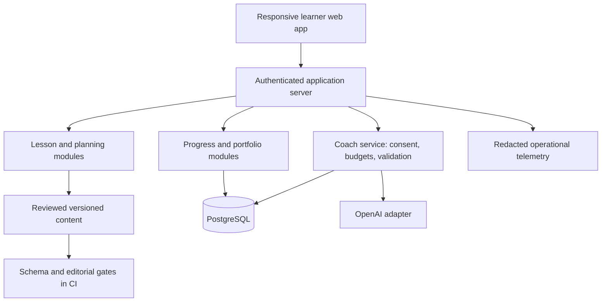

# Technical architecture

## Architecture decision

Start with a modular monolith: TypeScript, Next.js/React web UI and server routes, PostgreSQL persistence, schema-validated lesson JSON in Git, and one server-side model adapter. These are proposed implementation choices; pin compatible maintained versions and verify official framework documentation during kickoff. Use a maintained authentication library/provider selected at kickoff; do not implement password cryptography or session security from scratch.

Keep the learning engine deterministic. OpenAI is an optional coaching dependency, not the authority for access, scoring, mastery, publishing or billing. A provider outage must not prevent a learner from completing a lesson.

Deploy one containerized application and managed PostgreSQL in one region/provider selected after geography and data requirements are confirmed. Use a development database, isolated preview database, and production database. The first deployed release needs HTTPS, managed secrets, backups, health checks, migration handling and rollback instructions. No cloud deployment is authorized by this document alone.

## Modules and responsibilities

| Module | Responsibility | Must not do |
|---|---|---|
| Identity | Session validation and ownership | Trust user IDs supplied by the browser |
| Content | Resolve published lesson versions and prerequisites | Serve answer keys before submission |
| Planning | Produce daily units and review schedule | Optimize for time spent at the expense of stated goals |
| Assessment | Score checks and store rubric/evidence type | Accept authoritative scores from the client or coach |
| Portfolio | Save, export and delete learner text evidence | Make artifacts public by default |
| Coach | Produce hints for approved lesson context | Invoke arbitrary tools, publish content, change grades |
| Usage | Reserve, reconcile and cap model cost | Rely only on client-side counters |
| Analytics | Record minimal structured events | Log raw learner drafts or secrets |

## Data model

Use UUID identifiers, UTC timestamps, application validation and database constraints. Individual ownership is sufficient for MVP. Team tenancy and delegated manager access require a separate schema and authorization migration before the Teams release.

| Entity | Core fields and constraints |
|---|---|
| User | id, authSubject unique, timezone, rolePreference, dailyUnits 1–4, notificationConsent, deletedAt |
| Pathway | id, slug unique, title, status, prerequisiteSkillIds |
| LessonVersion | composite key lessonId/version, pathwayId, ordinal, contentHash, status, publishedAt, sourceCheckedAt |
| Enrollment | id, userId, pathwayId, startedAt; unique user/pathway |
| Attempt | id, userId, lessonId/version FK, state, stepIndex, draftText, rowVersion, startedAt, completedAt |
| Assessment | id, attemptId, quizScore, rubricScores, assessorType, assessmentVersion, submittedAt |
| Artifact | id, userId, attemptId, title, text, visibility=private, createdAt, updatedAt |
| SkillEvidence | id, userId, skillId, attemptId, level, assessorType, rubricVersion |
| ReviewItem | id, userId, skillId, dueAt, intervalStage, completedAt; one active item per user/skill |
| DailyPlan | id, userId, localDate, timezoneSnapshot, units JSON, revision; unique user/localDate |
| CoachRun | id, userId, attemptId, idempotencyKey, status, reservedCost, actualCost, modelConfigVersion, usage, latencyMs |
| UsageBudget | userId, periodStart, limit, reserved, spent; atomic updates |
| AuditEvent | id, actorId, action, resourceType/id, timestamp, redacted metadata |

Assessment records are append-only; a retry produces new evidence. Historical attempts keep the original lesson version. Account deletion removes or anonymizes all dependent personal records under the documented retention policy; logs must not preserve recoverable draft text.

Proposed MVP retention: portfolio until deletion; optional coach content logging disabled by default; operational metadata 30 days; daily backups retained 30 days. These are product choices, not statements of legal requirements or provider retention guarantees. Before pilot, document actual hosting/provider retention and delete/restore behavior. Deletion should remove live records within 7 days, and backup expiry follows the disclosed retention window. Tombstone deleted accounts so restoring a backup does not resurrect them into active service.

## API contract outline

All endpoints are under `/api/v1`. Derive identity from the server session. Validate ownership for every object access. Mutations validate origin/CSRF as appropriate to the chosen session scheme. Return structured errors: `{ code, message, requestId, retryable }` without secrets.

| Method and route | Request | Result |
|---|---|---|
| GET `/me/plan?date=YYYY-MM-DD` | Local date | Units, due reviews, plan revision |
| PATCH `/me/preferences` | role, dailyUnits, timezone | Validated preferences |
| GET `/paths/:slug` | — | Published course outline |
| GET `/lessons/:id?version=...` | Optional published version | Learner content without answer keys |
| POST `/attempts` | lessonId, version, idempotencyKey | Created or existing attempt |
| PATCH `/attempts/:id` | draft, step, expectedRowVersion | Saved state or 409 conflict |
| POST `/attempts/:id/assessments` | answers, selfRubric, reflection, idempotencyKey | Server quiz score, explanations, evidence status |
| POST `/attempts/:id/complete` | idempotencyKey | Completion only if all required conditions hold |
| POST `/coach/hints` | attemptId, question, includeDraftConsent, idempotencyKey | Validated hint or static fallback |
| GET/POST `/artifacts` | Filter / attemptId and text | Owned items / saved artifact |
| GET `/me/export` | — | Authenticated export of owned data |
| DELETE `/me` | Explicit confirmation token | Deletion job acknowledgement |

Use 400 for invalid schema, 401 unauthenticated, 404 for absent or unowned objects, 409 version conflict, 429 quota/rate limit, and 503 temporary service failure. Limit question length to 2,000 characters and draft length to 10,000 initially. Enforce request limits on the server; reject oversized bodies before calling a model.

State machine: `not_started → in_progress → submitted → completed`. Proficiency is a separate derived evidence label. `submitted` requires practice and assessment data; `completed` additionally requires required steps and reflection. Completion is atomic with the completion event and review scheduling, using an outbox or equivalent transactional delivery pattern.

## AI coaching design

MVP uses the Responses API through an adapter for a single hint request. Choose a model available to the deployment account and evaluate it against fixtures; configuration stores the model ID, prompt version, price assumptions and limits. Do not hard-code a “latest” model alias into grading logic.

Input: trusted coach instructions, the published active lesson, a bounded question, and an optionally consented draft. Treat learner text as untrusted data. No general browsing, external connectors, shell execution, arbitrary URL fetching, or workplace actions in the MVP coach.

Output schema: `{ hint, suggestedNextStep, lessonSectionIds, needsHumanReview }`. Validate section IDs against the lesson and cap output length. The coach should first offer a hint, explain using lesson concepts, avoid revealing quiz keys, and identify when the supplied material cannot answer the question. Do not claim citations are verified merely because they are syntactically valid.

Reserve an estimated maximum call cost atomically before dispatch; reconcile actual usage afterward. Example starting limits: five hints per learner per day, maximum 600 output tokens per hint, 12-second application timeout, one retry only for a transient failure if budget remains. These are configuration proposals. A timed-out request may still incur provider cost; retain its reservation until usage reconciliation instead of assuming it was free. Track costs without storing provider credentials or raw drafts in logs.

Cache only reusable nonpersonal hints keyed by lesson version and question category. Do not share personalized outputs across users. Explicitly show static guidance when the model is unavailable, output is invalid, or budget is exhausted. The coach cannot write assessment or entitlement tables.

## Agent and multi-cloud evolution

Keep three concepts distinct: Codex agents building this software, the learner-facing coach, and agents learners build in later labs. A multi-agent development team does not require a multi-agent production app.

Later, introduce Agents SDK workflows only for a measured need such as a bounded lab tutor coordinating a test runner. A manager can keep response ownership while invoking specialists, or hand control to a specialist. Evaluate those patterns against a single-agent baseline. [Official orchestration guidance](https://developers.openai.com/api/docs/guides/agents/orchestration).

Proposed application-owned harness responsibilities: run state, tool registry, permissions, approval checkpoints, time/step/cost budgets, trace redaction, cancellation, retry policy and replayable evaluation fixtures. A managed harness such as the Agents API is an alternative to assess when durable orchestration is needed. [Official overview](https://developers.openai.com/api/docs/guides/agents-api/overview).

Provider interface concept: `generateHint(request, capabilities, signal) → result + usage`. Capability metadata includes structured output, tool support, cancellation, residency, allowed models and accounting. Keep provider-specific request translation inside adapters and run contract tests for each. Do not assume Azure, AWS or GCP services have identical APIs, tool semantics, model versions or data policies. Those integrations are proposed curriculum topics, not verified integrations in this pack.

First portability milestone: deploy the same app container against one alternate environment with a separate config and database. Later agent lab milestone: demonstrate one explicitly tested alternate runtime and publish differences. Never silently fail over learner data across providers or regions; make routing a documented administrator decision.

## Threat model and operational controls

Principal assets: identity, private learner artifacts, API credentials, progress integrity and usage budget. Boundaries: browser/server, server/database, content pipeline, and server/model provider.

Mitigations: object-level authorization; allowlisted fields; escaped Markdown with raw HTML disabled; output schema validation; no model-triggered tools in MVP; server-only secrets; rate limits and atomic budgets; audit changes without content; dependency/secret scans; preview isolation; protected production access. Treat text in lessons, drafts and future retrieval documents as content, never privileged instructions.

Before public release test backup restoration, expired sessions, deletion, service outage, quota exhaustion, cross-user reads/writes, malicious HTML and prompt injection. Proposed recovery targets: 24-hour maximum data loss and 4-hour restoration, subject to a measured restore drill. Deployment must fail health checks if migrations or required configuration are missing; rollback uses the prior app image and a forward-compatible database migration strategy.
